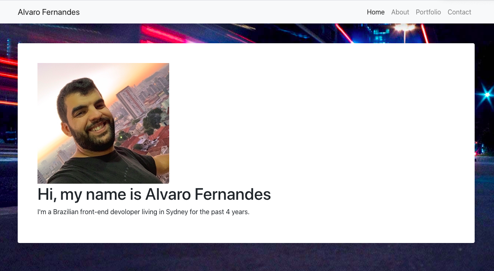

## React Portfolio

  ## Description
  
  My portfolio developed utilizing React, node and JSX.

  ## Table of contents
  
  * [Installation](#installation)
  * [Usage](#usage)
  * [License](#license)
  * [Contributing](#contributing)
  * [Questions](#questions)
  

  ## Installation
  
 To install this application is necessary to run the command "npm install" and "npm start" on the terminal. Also, this application is deployed on github pages. To accesses, the application [click here](https://alvarofernandes.github.io/React-Portfolio/). 

  ## Usage

This portfolio is a website that shows my projects, professional experiences and contacts.

Screen shot of application:

  ## License

  This application uses MIT License

  ## Contributing

  ## Questions

  Any other question feel free to contact me on my email fernandes.alvaro@gmail.com or my git hub profile [Github profile](https://github.com/AlvaroFernandes).

